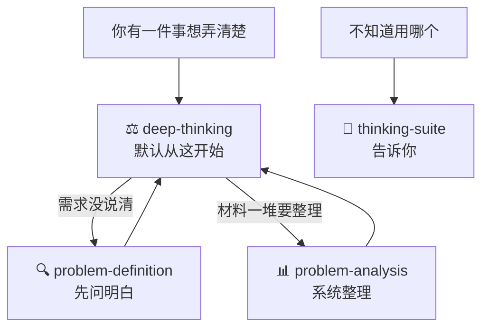

# thinking-skills

**装了这套技能，AI 会先把事想清楚，再回答你。**

问它"靠不靠谱"，给你一堆利弊；给它含糊的需求，它照着错的方向干；丢一堆材料，它只会复述。原因都一样：它没过脑子。

这套技能给 AI 装上一套思考工序：把问题拆到本质 → 多角度和对立面验证 → 给带把握的结论，并说清什么情况下要推翻重算。

---

## 一、这是什么

四个技能，各管一件事：

| 技能 | 干什么 | 什么时候用 |
|-|-|-|
| ⚖️ **deep-thinking** | 把一件事想透 | **默认入口**。想弄明白一件事、要下判断，先用它 |
| 🔍 **problem-definition** | 弄清到底发生了什么 | 需求说得含糊，不知道该问什么 |
| 📊 **problem-analysis** | 一堆材料整理成能行动的结论 | 挖根因、排优先级、验证方案 |
| 🚦 **thinking-suite** | 告诉你该用哪个 | 分不清的时候 |

配合方式：默认从 deep-thinking 开始；它发现需求没说清，先让 problem-definition 问明白；发现材料要系统整理，交给 problem-analysis。



---

## 二、什么场景下怎么用（核心）

每个场景四行：你碰到什么 → 不装技能会怎样 → 这句话就能用 → 拿到什么。

### 场景 1：有个判断要下，心里没底

**你碰到**："该不该自建数据平台？""这个方案靠谱吗？"

**不装技能**：AI 给你利弊清单，"总之要结合实际综合考虑"，看完还是不会选。

**这么说**："这个方案靠谱吗？" 或 "该不该自建数据平台？"（触发 deep-thinking）

**你拿到**：

> 结论：先采购，缓自建。把握 70%。
> 本质：这个问题不是技术选型，是在赌数据增长速度。
> 押的前提：数据量两年内不会涨 10 倍。
> 什么时候重算：6 个月内增速超过 5 倍，推翻重来。

### 场景 2：接到的需求说得含糊

**你碰到**：老板说"把客户拜访情况整理一下，周末给我"。"最近"是多久？"整理"成什么样？不知道，也不敢问。

**不装技能**：AI 直接给你整理模板。方向猜错，白干一场。

**这么说**："李总让我整理客户拜访情况，周末给他，感觉没说清楚。"（触发 problem-definition）

**你拿到**：

> 三个地方没说明白，建议当场问：
> 1. "最近"是过去 30 天吗？
> 2. 重点是拜访量，还是客户的问题和风险？
> 3. 要简表还是完整报告？
>
> 可直接发的确认话术："我确认下理解：把近一个月的拜访汇总成表，标出客户问题和风险，周末给您。有出入您说一声。"

### 场景 3：项目出事，材料一堆，没头绪

**你碰到**：项目延期三周，缺陷清单、变更记录、会议纪要摊了一桌。

**不装技能**：AI 把每份材料总结一遍，你还是不知道先干什么。

**这么说**："项目延期三周，这是缺陷清单和变更记录，帮我理出头绪。"（触发 problem-analysis）

**你拿到**：

> 根因：接口变更没有确认流程（7 个严重缺陷里 4 个从这里来，把握 70%）。
> 马上做：冻结未确认变更。排期做：建变更确认清单。不做：重构老模块。
> 有没有效看这个数：两周内未确认变更数降为 0。

### 场景 4：事情太多，不知道先做哪个

**你碰到**：分析完列出一堆要做的事，每件都有人说重要。

**不装技能**：AI 说"建议综合评估优先级"，等于没说。

**这么说**："这十几件事，先做哪个？帮我排一下。"（触发 problem-analysis 的决策矩阵）

**你拿到**：

> 影响大、难度低的本周做；影响大、难度高的立项排期；
> 影响小、难度低的顺手做；影响小、难度高的写进"不做清单"并同步给相关人。

### 场景 5：要跟领导汇报

**你碰到**：分析做完了，领导只给五分钟，从哪说起？

**不装技能**：AI 按你做分析的过程讲，领导听到第三分钟还没听到结论。

**这么说**："帮我把这个分析组织成汇报。"（触发 problem-analysis 的金字塔原理）

**你拿到**：

> 四段式：结论一句话 → 证据不超过 3 条 → 要干什么 → 一周后看什么数验证。结论永远在最前面。

### 点名用法速查

| 你说 | 触发 | 拿到 |
|-|-|-|
| "你怎么看 X""X 靠谱吗""该不该做 X" | deep-thinking | 结论 + 把握 + 押的前提 + 重算条件 |
| "深度思考一下 X" | deep-thinking | 完整思考过程 + 结论 |
| "老板让我做 X，感觉没说清楚" | problem-definition | 没说清的点逐条列出 + 确认话术 |
| "帮我筛一下这条转述里哪些是真的" | problem-definition | 事实和猜测分开，猜测标清楚 |
| "帮我理出头绪""找到根因" | problem-analysis | 根因 + 行动清单 + 验证指标 |
| "先做哪个" | problem-analysis | 排好优先级的清单 |
| "这个方案有什么风险" | problem-analysis | 最可能的失败方式 + 防御动作 |
| "这事怎么跟领导说" | problem-definition 或 problem-analysis | 三行版同步话术，或汇报结构 |
| "我该用哪个技能" | thinking-suite | 直接告诉你找谁 |

---

## 三、安装与上手

### 安装：一句话

你的 AI 能执行命令（DeepWorks、Claude Code、Cursor 等），就把这句话发给它：

```text
请克隆 https://github.com/guangquan123/thinking-skills，把里面的技能装到你的技能目录
```

只装需要的：

```text
请从 https://github.com/guangquan123/thinking-skills 只安装 deep-thinking 和 problem-analysis
```

手动装：克隆仓库后把需要的文件夹复制到 `~/.agents/skills/`。Windows 用资源管理器复制。

### 上手：大白话直接说事

不用记命令。装完说一句你自己的事，技能自己触发：

```text
这个数据治理方案你觉得靠谱吗？          → deep-thinking
李总让我整理客户拜访情况，感觉没说清楚。  → problem-definition
手里一堆缺陷清单和变更记录，帮我理出头绪。 → problem-analysis
```

---

## 四、四个技能详解

### ⚖️ deep-thinking：把一件事想透

你丢给它一个判断、一个选择、一个看不明白的局面，它按五步想完再答：

| 步骤 | 它做什么 |
|-|-|
| 1. 先问"你真正在问什么" | 你问"该不该自建数据平台"，它先想明白真正要答的是"现在的数据量，买现成的够不够用" |
| 2. 把信息分类 | 分清哪些是事实（查得到出处）、哪些是猜测、哪些是没验证的前提、哪些只是立场。缺关键信息先问你，不瞎猜 |
| 3. 换多个角度看 | 从本质、整体、各方利益、时间先后等角度至少看两遍 |
| 4. 让对立面攻击结论 | 站到反对者那边把自己的结论反驳一遍，找最薄弱的地方 |
| 5. 反着检查 | 问"什么情况下这个结论是错的"，提前把翻车点找出来 |

**最后给你三样**：结论（标把握多大）、押了什么前提（前提不成立结论推翻）、出现什么情况重算。

**例子**：

> 你问："我们的瓶颈是人手不够"，这个判断对吗？
> 它答："把握不高，大概 40%。事实部分：近两个月需求涨了 3 倍，是真的。但'人手不够'是解释，还有两个没排除的可能：需求砍得不够，或返工占了太多时间。建议先查返工率，再决定加不加人。"

**你可以说**："这个方案靠谱吗" "该不该接这个项目" "这个判断成立吗" "深度思考一下 X"。

### 🔍 problem-definition：先弄清发生了什么

接到含糊交代、别人转述、说不清的一句话时，它先弄清"到底发生了什么"。问题弄错，干得越快浪费越大。

它做三件事：

1. **拆话**：把话里的内容分成三栏。事实（带出处）、感受、没验证的猜测，分开列。
2. **找缺口**：逐条过"谁、什么时候、什么范围、当初承诺的是什么"，只能靠猜的地方就是要当场问的问题。
3. **追证据、验假设**：往下追问原因，问到第一个拿不出证据的地方停，告诉你"还差哪些证据"；把你想当然的前提逐条挑出来，问"验证过吗"。

八个方法可整流程走，也可单个点名（详见[第五章](#models-pd)）。

**例子**：

> 你说：帮我筛一下这句转述："听说小王开会又迟到半小时，明显不重视项目。"
> 它答："事实：小王某次会议迟到约 30 分钟（来源待查签到记录）。'听说'说明来源不清；'又'暗示经常发生但没有记录；'不重视项目'是猜动机，不能当事实。建议先查签到记录，再决定要不要谈。"

**你可以说**："老板让我做 X，感觉没说清楚" "帮我筛一下这条转述" "用 5 Why 追一下原因" "这事怎么跟领导说"。

### 📊 problem-analysis：把材料整理成能行动的结论

问题清楚了，但材料一堆、千头万绪。它按"场景配模型"做系统分析，最后给你一张能直接照着干的分析卡。

四步：

1. **填问题卡（30 秒）**：背景一句话、要做的决定一句话、怎么算解决一句话。
2. **对场景**：你属于 16 种常见场景的哪一种。
3. **配模型**：每种场景配好了思考模型，一次分析通常用 2-4 个（16 个模型详见[第五章](#models-pa)）。
4. **交付前自查**：用 5 个问题查常见错误：是不是第一个解释就没再怀疑？是不是只找了支持自己的证据？是不是因为投入太多舍不得推翻？

**产出分析卡**：

```text
根因（带把握程度）
关键证据（3 条以内）
行动清单：马上做 / 排期做 / 顺手做 / 不做
验证指标：一周后看什么数、变到多少算有效
没查透的：单独列，附下一步怎么查
```

**例子**：

> 你问：项目延期三周，帮我找到根因，排个优先级。
> 它答："根因：接口变更没有确认流程（把握 70%）。马上做：冻结未确认变更；排期做：建确认清单；不做：重构老模块。验证：两周内未确认变更数降为 0。未查透：测试环境的影响还没排除，下一步查测试记录。"

**你可以说**："帮我理出头绪" "找到根因" "先做哪个" "用决策矩阵排一下" "帮我把分析组织成汇报"。

### 🚦 thinking-suite：告诉你用哪个

分不清用哪个时把问题丢给它。它告诉你找谁、为什么。它自己不分析问题。

---

<a id="models"></a>

## 五、思维模型详解

每个技能背后是一组思维模型。下面每个模型四件事：管什么用、什么原理、怎么用、怎么唤起。

problem-analysis 的 16 个模型都附带**现成提示词**——不装技能，直接复制给任何 AI（ChatGPT、DeepSeek、豆包、Kimi）也能用，替换〔〕里的内容即可。

<a id="models-dt"></a>

### deep-thinking 的 6 个思考方法

**1. 问题重构 —— 先问"你真正在问什么"**

- 管什么用：防止答非所问。很多问题的表面问法和真正要解决的不是一件事。
- 原理：先写"你真正在问什么"再回答；区分表象问题和根本问题，必要时用 5 Why 往下钻一层。
- 例子：你问"该不该跳槽"，真正的问题可能是"我在现在的工作里为什么没有意义感"。
- 唤起："这件事的本质是什么" "我真正该回答的问题是什么"

**2. 信息四分类 —— 事实、推断、假设、观点分开**

- 管什么用：防止把猜测当事实用。
- 原理：把你给的信息分四类。事实（出处可查）、推断（由事实推出）、假设（没验证就当前提）、观点（立场判断），不混写。缺关键信息先问 1-2 个问题。
- 唤起："把我刚才说的分一下类，哪些是事实哪些是猜的"

**3. 多框架拆解 —— 至少换两个角度看**

- 管什么用：防止单一视角盲区。
- 原理：同一个问题至少用两个框架看：第一性原理（剥掉假设看基本事实）、MECE（查重叠查漏项）、系统视角（看整体联系）、利益相关方（各方要什么）、时间尺度（短期长期不一样）、逆向思考（反过来想）。
- 唤起："换个角度再看一遍" "还有什么角度我没考虑"

**4. 对立面攻击 —— 站到反对者那边反驳自己**

- 管什么用：防止只收集支持自己的证据。
- 原理：把反对意见讲到反对者本人都认可的程度，再回头看自己的结论哪里最脆。不立稻草人，立最强的对手。
- 唤起："你站到我的对立面，把这个结论驳一遍"

**5. 二阶后果 —— 问两次"然后呢"**

- 管什么用：防止只想第一步后果。
- 原理：想到行动的后果，还要想后果的后果。重点写其他人会怎么反应。
- 唤起："这么做之后，别人会怎么反应，然后又会怎样"

**6. 事前验尸 —— 先假设结论已经错了**

- 管什么用：高成本、不可逆的决策防翻车。
- 原理：假设半年后证明这个结论错了，倒推最可能的 3 种失败原因，每种写一句提前预防或监测动作。
- 唤起："假设这个决定最后错了，最可能错在哪"

<a id="models-pd"></a>

### problem-definition 的 8 个界定方法

**1. 问题分型 —— 先分清是哪种问题**

- 管什么用：三种问题的问法完全不同，混着处理会出错。
- 原理：发生型（已经出事，问原因）、潜在型（怕要出事，问怎么防）、理想型（想做得更好，问差距）。分型可以复合。
- 唤起："这是发生型、潜在型还是理想型问题"

**2. 还原事实 —— 把主观词改写成能核实的说法**

- 管什么用：让"太慢、很乱、不配合"变成可以验证的说法。
- 原理：改写规则是"谁 + 具体时间 + 什么行为 + 多少量 + 出处"。"流程很复杂"改成"一个审批过 7 个节点、3 个系统（OA 记录）"。
- 唤起："把这句话还原成可核实的事实"

**3. 筛事实 —— 从转述里分出事实和加工**

- 管什么用：防止把别人的猜测当事实接收。
- 原理：找加工痕迹信号："听说"（来源不清）、"又、总是、从不"（绝对化）、"明显是……"（猜动机）。找到后核验三问：来源能追溯吗、说的人在场吗、有记录吗。
- 唤起："帮我筛一下这条转述里哪些是真的"

**4. 5W2H 补边界 —— 逐条扫哪里没说明白**

- 管什么用：找出需求里的空位。
- 原理：过一遍谁、什么事、什么时候、哪里、为什么、怎么做、多少。"为什么"问两遍：为什么出问题 + 当初的承诺基于什么依据。凡是只能靠猜的空位，就是要当场问的问题。
- 唤起："按 5W2H 帮我扫一遍这个需求缺什么信息"

**5. 5 Why 追原因 —— 问到第一个没有证据的地方**

- 管什么用：不停在表面原因，也不瞎猜到底。
- 原理：一层层追问，每层的答案必须是上一句的直接原因；问到第一个只能靠猜的环节就停在那里，列出"需要补的证据"。AI 追问，你给依据。
- 唤起："用 5 Why 帮我追原因"

**6. 假设反证 —— 把想当然的前提挑出来**

- 管什么用：最危险的前提是你没意识到自己在用的那些。
- 原理：列出结论依赖的每个假设，逐个问"验证过吗？如果它不成立呢？"已经在执行的补救方案优先做"承重墙检验"：方案成立靠哪几个前提，这些前提验证过吗。
- 唤起："我这个判断里有哪些没验证过的假设"

**7. 目标-现状-差距 —— 把"要不要换"改成"差多少"**

- 管什么用：让"要不要换人/换工具"这种判断题变成可验证的问题。
- 原理：改写成"目标是什么、现状是什么、差距多少、影响多大"。改写后说不出差距，说明问题还没界定清楚。
- 唤起："把目标和现状的差距摆出来"

**8. 向上沟通 —— 三行同步 + 追问预案**

- 管什么用：出事时让领导三分钟听完，且追问有准备。
- 原理：三行结构：发生了什么事、影响什么 / 已经做了什么 / 需要他做什么。附领导可能追问的问题和答案要点。
- 唤起："这事怎么跟领导说，帮我准备三行版和追问预案"

<a id="models-pa"></a>

### problem-analysis 的 16 个思维模型

8 个高频（★）。全程案例：项目还有三周上线，测试报出 40+ 缺陷，60% 集中在接口模块，需求已变更 17 次。

#### 定义问题阶段

**1. 5 Why 追问法 ★**

- 管什么用：问题只有一句话、真因藏在后面时，防止对着表象干活。
- 原理（源自丰田生产方式）：连续追问"为什么"，每个回答必须是上一句的直接原因，问到能动手改的一层就停。
- 案例：项目延期 → 为什么 → 核心模块联调通不过 → 为什么 → 接口文档版本不一致 → 为什么 → 文档没有唯一负责人。停，"指定负责人"就是能改的一层。
- 提示词：`用 5 Why 追问法帮我分析：对我的问题连问"为什么"，最多 5 次，我每次只答一句，答不上记"待查"别让我猜，问到能动手改的东西就停。我的问题：〔 〕`

**2. 第一性原理**

- 管什么用：所有人都说"显然该这么做"时，查一查"显然"背后藏了什么假设。
- 原理：剥掉所有默认假设，回到基本事实重新推导。
- 案例："延期就加人"的隐藏假设是"人手不足是瓶颈"。剥掉它看事实：缺陷 60% 集中在接口模块，是协作问题，加人没用。
- 提示词：`用第一性原理审视我的判断：〔写判断〕。列出它依赖的所有默认假设，逐个标注"有证据/没证据/想当然"，然后只基于有证据的事实重新定义问题。`

#### 拆解问题阶段

**3. 逻辑树 ★**

- 管什么用：问题大而模糊时，先拆成可以逐块检查的小问题。
- 原理（金字塔原理自上而下分解）：按同一维度逐层拆解。关键：树是暂定地图，不是结论，它告诉你去哪里找证据。
- 案例：项目延期拆成需求、资源、技术、协作、计划五支；证据指向协作，继续往下拆出接口文档未定稿、排期不对齐、变更无同步。
- 提示词：`用逻辑树帮我拆解问题：〔描述〕。搭一棵暂定逻辑树，3-5 个主分支，同一层同一维度，不重复不遗漏，每支标注"待验证"，然后问我哪支证据最多。`

**4. 归纳法**

- 管什么用：手里只有零散材料、没有问题框架时，从材料里长出结论。
- 原理（自下而上）：从事实和记录出发，归类相似项、找重复模式、提待验证假设。注意：归纳出的是模式不是真相，受样本和口径影响，必须再验证。
- 案例：翻缺陷清单、变更记录、排期表，归纳出假设"接口联调可能是最大瓶颈"。
- 提示词：`用归纳法帮我分析材料：〔贴材料〕。按相似性归类，找出重复出现的模式，提出 1-2 个待验证假设，并提醒可能受什么偏差影响。`

**5. MECE 原则 ★**

- 管什么用：分类分支打架、越看越乱时，查重叠查漏项。
- 原理（源自麦肯锡）：分支之间不重复，重要范围不遗漏，同层同维度。检查三问：两支是不是一件事？重要情况覆盖了没？同一层是同一个维度吗？
- 案例："需求蔓延、张三离职、计划太紧"不该同层，分别是现象、人、原因；按"原因"重组为需求管理、人员管理、计划管理。
- 提示词：`用 MECE 检查我的分类：〔贴分类〕。指出重复项、遗漏项和维度混乱的地方，然后按同一维度重新组织。`

**6. 假设-验证闭环 ★（核心方法）**

- 管什么用：问题重要又复杂时，防止围着错误假设找证据，或看了很多判断很少。
- 原理（科学方法）：归纳提假设 → 演绎搭原因树 → 证据验证 → 输出"结论-证据-行动-验证指标" → 行动后带新事实进入下一轮。分析完不是结束。
- 提示词：`带我走假设-验证闭环：① 从我的材料归纳模式；② 演绎出原因树；③ 列出每支需要的验证证据；④ 输出"结论-证据-行动-验证指标"四件套。我的问题和材料：〔 〕`

**7. 反事实检验**

- 管什么用：候选原因都说得通、资源只够修一个时，锁定主因。
- 原理：对每个原因问"如果它不存在，问题还会发生吗？"还会发生就不是主因，不会发生大概率就是它。
- 案例：文档版本统一了联调还会卡吗？不会，主因确认。环境更稳定联调还会卡吗？还会，环境不是主因。
- 提示词：`用反事实检验帮我锁定主因。候选原因：〔列出来〕。对每个原因问："如果它不存在，问题还会发生吗？"判断哪个是主因，哪个只是伴随现象。`

**8. 80/20 法则 ★**

- 管什么用：问题几十条、资源只够打一两个时，不平均用力。
- 原理（帕累托法则）：少数原因造成多数结果。按来源统计排序，集中火力打贡献最大的少数。
- 案例：缺陷 60% 集中在接口模块，先集中解决接口文档问题，其他放第二批。
- 提示词：`用 80/20 法则帮我排优先级。问题清单：〔列出来〕。统计每类占比，指出贡献最大的少数来源，告诉我集中先解决哪个，其余怎么放。`

#### 验证与决策阶段

**9. 证伪思维 ★**

- 管什么用：证据越攒越多、越查越自信时，这是危险信号，你可能只在收集认同。
- 原理（卡尔·波普尔）：结论必须可被推翻；主动找反例比继续找支持更有价值。规则：一条反例顶五条支持。配套证据三问：谁给的？全吗？口径一致吗？
- 提示词：`用证伪思维审我的结论：〔写结论和证据〕。先对每条证据问：谁给的？全不全？口径一致吗？然后主动找反例：给出三个可能推翻它的方向。`

**10. 概率思维**

- 管什么用：结论要拍了心里没底时，把"差不多"变成具体数字。
- 原理（贝叶斯更新）：结论是概率不是定论，每条新证据都应该更新它。50% 以下继续查；50-80% 标注待确认；80% 以上可行动。每出现一个反例先扣 20 分。
- 提示词：`用概率思维评估我的结论：〔写结论〕。证据：〔列证据〕。给结论打把握分（百分比），列出扣分项，不到 80% 告诉我还差什么。`

**11. 换位思考**

- 管什么用：怕漏了相关方掌握的信息和反应。
- 原理（视角切换）：每个相关方答三问：他的目标是什么？他的约束是什么？他手里有什么你不知道的信息？每个人的信息差都是你的盲区。
- 提示词：`用换位思考补全我的分析：〔描述问题和当前判断〕。列出所有相关方，对每个角色分析：目标、约束、他手里可能有什么我不知道的信息。`

**12. 逆向思维**

- 管什么用：方案怎么看都没毛病、反而心里发虚时，太顺了才可疑。
- 原理（查理·芒格的 Inversion）：不想"怎么让它成功"，反过来想"什么会让它必然失败"。列 3 个最可能失败的方式，逐个检查防住了没有。
- 案例："冻结需求就能按期"反过来想：客户绕过变更流程、关键需求被误砍。防住这两条方案才成立。
- 提示词：`用逆向思维检验我的方案：〔写方案〕。列出三个最可能让它失败的方式，逐个检查有没有防住，缺哪条补哪条。`

**13. 二阶思维**

- 管什么用：行动要定了，怕连锁反应。
- 原理（霍华德·马克斯）：想到后果，还要想后果的后果。问两次"然后呢"，重点写别人会怎么反应。第二个"然后呢"里有不能接受的，回去改方案。
- 案例：冻结需求变更 → 客户口头答应私下继续提 → 变更绕过流程两周后失控。结论：冻结要客户签字，同时留每周一次的变更评审通道。
- 提示词：`用二阶思维推演我的行动：〔描述〕。问两次"然后呢"，每步写下来，重点写相关人会怎么反应。第二个"然后呢"里有不能接受的结果，就帮我改方案。`

**14. 决策矩阵 ★**

- 管什么用：能做的事十几件、每件都有人说重要时，排出先后。
- 原理（影响 × 难度四格）：每件事打两个分，影响（1-5）和难度（1-5）。影响大难度低马上做；影响大难度高立项排期；影响小难度低顺手做；影响小难度高写进"不做清单"。
- 提示词：`用决策矩阵帮我排行动：〔列清单〕。给每件打影响分和难度分（各 1-5），放进四格（马上做/排期做/顺手做/不做清单），告诉我先做哪件，为什么。`

#### 收尾阶段

**15. 沉没成本**

- 管什么用：总想"再查一点更稳"、交不出手时。
- 原理：已投入的时间不应影响"继续还是停"的判断，标准是边际：再查下去结论会变吗？三条停止线满足任一就交：剩下的疑问不影响结论方向；再查一天结论不会变；到时间了。没查透的单独列一节。
- 提示词：`用沉没成本原则判断我该不该停：〔分析现状、已投入多少、还剩什么疑问〕。只看边际：剩下的疑问影响结论方向吗？再查一天结论会变吗？该交就让我交。`

**16. 金字塔原理 ★**

- 管什么用：分析做完了要汇报，领导只给五分钟。
- 原理（结论先行）：按对方关心的顺序讲，不按你分析的顺序讲。四段式：结论一句话 → 证据（3 条以内）→ 行动 → 验证指标。
- 案例："结论：最大瓶颈是接口文档未冻结。证据：缺陷 60% 集中在接口模块；文档改过 5 版双方版本不一致。行动：冻结 v2.0 指定唯一负责人。验证：一周后接口缺陷占比降到 30% 以下。"
- 提示词：`用金字塔原理帮我组织汇报：〔贴分析结论和证据〕。输出四段式：结论（一句话）→ 证据（三条以内）→ 行动 → 验证指标。结论先行，大白话。`

---

## 六、凭什么信它

四条规矩，所有技能一致执行：

1. **不编**：缺数据写"待确认"，不拿猜测凑数。
2. **猜的必标注**：AI 推出来的内容统一标"待核实"。
3. **事实带出处**：说不出出处的只能算印象。
4. **结论带把握**：不给把握程度的结论是不完整的结论。

方法来源：problem-definition 的界定方法来自《如何界定问题思维模型》并经实战复盘打磨；problem-analysis 的模型库为公开经典思维模型，每个模型的完整用法、更多案例和原始提示词收录在 `problem-analysis/references/models.md`。
