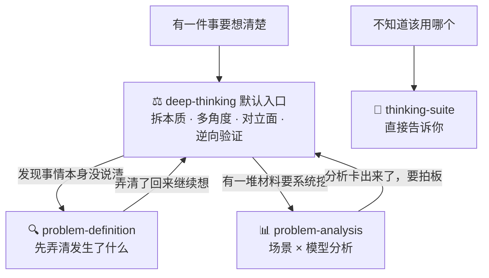

# thinking-skills

thinking-skills 是一套给 AI 用的思考技能集合，共 4 个成员。

你把一件事丢出来，它按固定工序想清楚再回答。

默认入口是 **deep-thinking**，也是最常用的一个：想把一件事想透，从它开始。它用第一性原理把事拆到本质，换多个角度看，站到对立面反驳自己，再用逆向思考检查一遍，最后给你一个带置信度的结论：有多大把握、押在什么假设上、出现什么情况要重算。

其余三个成员各管一件专门的事：事情本身说得含糊，先用 **problem-definition** 弄清到底发生了什么；手头一堆材料要系统挖，用 **problem-analysis** 按场景配模型出分析卡；不知道用哪个，问 **thinking-suite**。

## 阅读地图：这一页按一条信息模型组织

这一页回答 6 个问题，按顺序往下读即可：

| 你的问题 | 看哪一章 |
|-|-|
| 这套东西是什么、四个成员怎么分工 | [1. 一眼看懂](#skills) |
| 我的事该用哪一个 | [2. 怎么选](#how) |
| 它解决什么真实处境 | [3. 三种典型处境](#situations) |
| 每个成员具体能干什么、怎么干、产出什么 | [4. 各 skill 详解](#detail)（四个成员统一模板：干什么 / 怎么工作 / 产出什么 / 怎么唤起 / 什么时候交出去） |
| 怎么装、第一句话怎么开口 | [5. 安装与第一次跑](#install) |
| 它的话能信到什么程度 | [6. 凭什么信它](#trust) |

---

<a id="skills"></a>

## 1. 一眼看懂：四个成员怎么分工

| Skill | 定位 | 干什么（一句话） | 什么时候用 |
|-|-|-|-|
| ⚖️ **deep-thinking** | 默认入口 · 最常用 | 把一件事想透：第一性原理拆到本质，多角度 + 对立面检验，逆向验证，输出带置信度的结论 | 想把一件事想清楚、要下判断时 |
| 🔍 **problem-definition** | 界定 | 接到模糊交代或转述时，先弄清"到底发生了什么"再行动 | 事情本身没说清 |
| 📊 **problem-analysis** | 系统分析 | 一堆材料按场景配模型，产出能直接行动的分析卡 | 要挖根因、排优先级、验证方案、组织汇报 |
| 🚦 **thinking-suite** | 路由 | 告诉你该用哪个成员 | 不确定用哪个 |

一句话记住分工：**默认都从 deep-thinking 开始；它想的过程中发现事没说清，退回 problem-definition；发现要大量系统挖，移交 problem-analysis。**

<a id="how"></a>

## 2. 怎么选（协作图 + 场景速查）



**场景速查表**（按顺序判断，命中即停）：

| 你的处境（真实说法） | 用哪个 | 你会拿到什么 |
|-|-|-|
| "这个方案靠谱吗 / 该不该接这个项目 / 你怎么看 X" | deep-thinking | 分置信度的结论 + 关键假设 + 重判触发器 |
| "深度思考一下 X / /deep X" | deep-thinking（强制全流程） | 完整思考过程 + 带置信度结论 |
| "老板/客户让我做 X，我总觉得没说清楚，但不知道问什么" | problem-definition（接收确认） | 三栏分离表 + 待问问题清单 + 可直接发出的核对话术 |
| "最近团队氛围很怪，我说不上来哪里不对" | problem-definition | 从还原事实切入的界定过程 |
| "帮我筛一下这条转述里哪些是真的" | problem-definition（单点取用） | 事实 / 解读两栏，推测标"待验证" |
| "项目延期了，一堆缺陷清单和变更记录，帮我理出头绪" | problem-analysis（直接分析） | 分析卡：根因 + 证据 + 行动清单 + 验证指标 |
| "事情十几件资源有限，先做哪个" | problem-analysis（决策矩阵） | 四格优先级：马上做 / 排期做 / 顺手做 / 不做清单 |
| "这个方案看着完美，我心里发虚" | problem-analysis（逆向思维） | 最可能的 3 种失败方式 + 逐条防御检查 |
| "这事怎么跟领导说" | 简短同步 → problem-definition⑧；正式汇报分析成果 → problem-analysis 场景 16 | 三行版 + 追问预案 / 金字塔四段式 |
| "这几个 skill 我该用哪个" | thinking-suite | 路由结论 + 裁决理由 |

<a id="situations"></a>

## 3. 三种典型处境

**处境一：你有个判断，但心里没底。**

"该不该自建数据平台？""这个方案靠谱吗？"问 AI，它给你一堆利弊清单，看完还是不会选。

找 deep-thinking。它给的是：结论、把握程度、押在哪个假设上、出现什么情况要推翻重算。

**处境二：你接到一件事，对方说得含糊。**

"把客户拜访情况整理一下，周末给我。"你觉得不对，但说不上来该问什么。

找 problem-definition。它把没说明白的点一条条列出来，并给你一段可以直接发出去的确认话术。

**处境三：项目出事了，材料一堆，不知道从哪下手。**

延期三周，缺陷清单、变更记录、会议纪要摊了一桌。再开一次会也理不出头绪。

找 problem-analysis。它按场景匹配思维模型，给你根因、"先做/后做/不做"清单和验证指标。

---

<a id="detail"></a>

## 4. 各 skill 详解

四个成员用同一个模板介绍：干什么 / 怎么工作 / 产出什么 / 例子 / 怎么唤起 / 什么时候交出去。

<a id="dt"></a>

### ⚖️ deep-thinking：把一件事想透

**干什么**：你丢出一件事（一个判断、一个选择、一个看不明白的局面），它沿四条线想完，给你本质和带置信度的结论。这是集合的默认入口，最常用的成员。

**怎么工作**：三条核心步必走，四个可选步按需加。

| 步骤 | 它做什么 |
|-|-|
| 1 拆到本质（核心步，问题重构） | 先写"你真正在问什么"，再答。你问"该不该自建数据平台"，真正要回答的可能是"两年内的数据量，采购产品够不够撑"。必要时用 5 Why 往下穿一层 |
| 2 清点信息（核心步） | 把你给的信息分四类：事实（出处可查）、推断（由事实推出）、假设（没验证就当前提用）、观点（立场判断），不混写。缺关键信息先问 1-2 个问题，不猜 |
| 3 多角度 + 对立面（可选步 A/B） | 有多个合理角度时，至少换两个框架看：第一性原理、MECE、系统视角、利益相关方、时间尺度、逆向思考。有对立观点时，站到对立面把自己的结论反驳到无话可说，找出最薄弱处 |
| 4 逆向验证（可选步 C/D） | 连问两次"然后呢"，写出连锁后果和相关人的反应。高成本决策先假设"结论错了"，倒推最可能的 3 种失败原因，每条写一句预防或监测动作 |
| 收口（核心步，结论+置信度） | 结论按把握分层，列出关键假设和重判触发器 |

**产出什么**：

- 结论，分高 / 中 / 低把握（或百分比）
- 关键假设：哪几条不成立，结论就要推翻
- 重判触发器：出现什么信息时要重算
- 走完整流程时附完整思考过程

**例子**（演示）：

> 问题："该不该自建数据平台？"
> 一般回答：自建 vs 采购的利弊清单，看完还是不会选。
> deep-thinking 的回答："结论【把握 70%】：先采购，缓自建。这个问题的本质不是技术选型，是在赌数据增速。关键假设：数据量两年内不涨 10 倍。重判触发器：6 个月内增速超过 5 倍，重算。"

**怎么唤起**："你怎么看 X""X 靠谱吗""该不该做 X""这个判断成立吗""深度思考一下 X"。没有限定词的思考请求默认由它接。

**什么时候交出去**：想的过程中发现事情本身说得含糊，先交 problem-definition 弄清；发现需要大量系统挖（根因 / 一堆乱材料 / 排优先级 / 汇报组织），移交 problem-analysis。

<a id="pd"></a>

### 🔍 problem-definition：先弄清发生了什么

**干什么**：你接到的是模糊交代、转述、一句说不清的话时，它先帮你弄清"到底发生了什么"。问题弄错了，行动越快浪费越大。

**怎么工作**：三步。

1. **拆话**：把你听到的分成三栏。事实（带出处）、感受（主观反应）、判断（未经检验的解释），不混写。
2. **找缺口**：按 5W2H 清单过一遍：谁、什么时候、什么范围、当初基于什么承诺。凡是只能回答"我猜"的地方，就是一个要当场问的问题。
3. **追因与验假设**：5 Why 追到第一个没有证据的环节就停，列出"需要补的证据"；把你想当然的假设逐条列出来，问"它验证过吗"。

八个方法也可以单个点名用：

| 方法 | 它帮你做什么 |
|-|-|
| ① 问题分型 | 区分发生型 / 潜在型 / 理想型，不同类型用不同的问法 |
| ② 还原事实 | 把"很乱、太慢、不配合"改写成有出处的可核实事实 |
| ③ 筛事实 | 从汇报、邮件、转述中分出事实和加工痕迹 |
| ④ 5W2H 补边界 | 补齐对象、时间、范围、依据 |
| ⑤ 5 Why 追原因 | 追到第一个没有证据的环节，停在那里 |
| ⑥ 假设反证 | 把你想当然的假设逐条检验 |
| ⑦ 目标-现状-差距 | 把"要不要换 X"改写成可验证的差距问题 |
| ⑧ 向上沟通 | 三行同步 + 追问预案 + 汇报前检查清单 |

五种使用模式：

| 模式 | 什么时候用 | 它怎么做 |
|-|-|-|
| 接收确认 | 正从别人那里接到交代 / 转述 | 不分析问题本身，先拆话、扫缺口、给核对话术 |
| 单点取用（默认） | 点名某个方法 | 只执行该方法，直接给结果 |
| 完整界定 | "帮我把这个问题梳理清楚" | 分型 → 事实 → 5W2H → 5Why → 假设反证 → 收束，分步交互 |
| AI 推荐 | 丢来模糊描述，没说要什么 | 判断最缺哪一步，从那一步切入 |
| 二次界定 | 同一问题又来了新信息 | 只做增量，不重跑全流程 |

**产出什么**：

- 三栏表：事实（带出处）/ 感受 / 判断（标"待验证"）
- 要当场问的问题清单
- 可直接发出的核对话术
- 一句话收束：现状 + 目标 + 差距 + 影响

**例子**（演示）：

> 原话："最近团队配合很差，项目推进特别慢。"
> 界定后："过去三周，接口联调比计划晚 8 个工作日；其中 4 次延期没有负责人确认记录。'配合很差'是待核实的解释，不是事实结论。要不要先补这几条记录再决定动谁？"

**怎么唤起**："老板让我做 X，感觉没说清楚""帮我筛一下这条转述里哪些是真的""用 5 Why 追一下""把目标和差距整理出来"。

**什么时候交出去**：界定清楚后，要下判断的交 deep-thinking，要系统挖材料的交 problem-analysis。

<a id="pa"></a>

### 📊 problem-analysis：把材料系统地消化掉

**干什么**：问题已经清楚，但材料一堆、头绪很乱。它按场景匹配思维模型，把材料消化成能直接行动的分析卡。

**怎么工作**：四步。

1. **填问题卡（30 秒）**：背景一句话，要做的决定一句话，怎么算解决一句话。
2. **对场景**：对照下面 16 个场景，找到你现在卡在哪一格。
3. **配模型**：每个场景配好对应的思维模型（共 16 个），一次分析通常用 2-4 个。
4. **出分析卡并自查**：交付前过一遍"汇报前五句自查"，答了一个"是"就回去补：
   - 是不是听到第一个解释就没再找别的？
   - 是不是因为最近见过类似案例就信了？
   - 是不是只看了出问题的，没看没出问题的？
   - 是不是只收集了支持自己想法的证据？
   - 是不是因为已经投入很多，舍不得推翻？

**16 个场景地图**（按分析四步分组，★ 为高频模型）：

问题定义阶段：

| 你现在的场景 | 配哪个模型 | 模型怎么执行 |
|-|-|-|
| 问题只有一句话，真因藏在后面 | 5 Why ★ | 每个回答必须是上一句的直接原因，问到能动手改的一层就停 |
| 所有人都说"显然该这么做" | 第一性原理 | 列出全部默认假设，逐条标"有证据/没证据/想当然"，只基于有证据的事实重新定义问题 |

拆问题阶段：

| 你现在的场景 | 配哪个模型 | 模型怎么执行 |
|-|-|-|
| 问题大而模糊 | 逻辑树 ★ | 拆成 3-5 个同维度分支；树是地图不是结论，挑证据最多的一支继续拆 |
| 只有一堆零散材料 | 归纳法 | 归类 → 找重复模式 → 提待验证假设；模式不等于真相，标注偏差来源 |
| 分支之间打架，有重叠有遗漏 | MECE ★ | 三查：两支是不是一件事？重要情况覆盖了没？同层同维度吗？ |
| 问题重要又复杂，证据乱 | 假设-验证闭环 ★ | 归纳提假设 → 演绎搭原因树 → 证据验证 → 输出"结论-证据-行动-验证指标"，行动后带新事实回来再走一轮 |
| 候选原因都说得通 | 反事实检验 | 逐个问"这个原因不存在，问题还会发生吗？" |
| 问题几十条，资源只够打一两个 | 80/20 ★ | 按来源统计占比，集中打贡献最大的少数 |

验证与决策阶段：

| 你现在的场景 | 配哪个模型 | 模型怎么执行 |
|-|-|-|
| 证据越攒越多，越查越自信 | 证伪思维 ★ | 结论必须可被推翻；一条反例顶五条支持；证据三问：谁给的？全吗？口径一致吗？ |
| 结论要拍了，心里没底 | 概率思维 | 标把握分：低于 50% 继续查；50-80% 待确认；80% 以上可行动；每出现一个反例先扣 20 分 |
| 怕漏了相关方掌握的信息 | 换位思考 | 每个相关方答三问：他的目标？他的约束？他手里有什么你不知道的信息？ |
| 方案看着完美，心里发虚 | 逆向思维 | 反过来想"什么会让它必然失败"：列 3 个最可能失败方式，逐条检查防住了吗 |
| 行动要定了，怕连锁反应 | 二阶思维 | 问两次"然后呢"，重点写相关人会怎么反应 |
| 事情十几件，先做哪件 | 决策矩阵 ★ | 影响和难度各打 1-5 分：影响大难度低马上做；影响大难度高排期；影响小难度低顺手做；影响小难度高写进不做清单 |

收口阶段：

| 你现在的场景 | 配哪个模型 | 模型怎么执行 |
|-|-|-|
| 总想"再查一点更稳" | 沉没成本 | 只看继续查的边际收益，满足停止线就交；没查透的单独列一节 |
| 分析完了，要汇报 | 金字塔原理 ★ | 结论先行，按对方关心的顺序组织：结论 → 证据（3 条以内）→ 行动 → 验证指标 |

三种工作模式：

| 模式 | 什么时候用 | 它怎么做 |
|-|-|-|
| A 教练模式 | 你想自己想清楚（"带我分析""一步步来"） | 一次只问 1-2 个问题引导你，全程大白话 |
| B 直接分析（默认） | 给问题 + 材料要结果 | 代跑四步流程，输出完整分析卡 |
| C 单模型工具 | 点名某个模型（"用 5 Why 帮我追"） | 直接执行该模型，只输出对应结果 |

**产出什么**（分析卡）：

```text
【问题卡】背景 / 要做的决定 / 怎么算解决
【场景判断】当前卡在哪个场景，走过哪些模型
【分析过程】每个模型一段：做了什么、发现了什么
【结论】带把握分（%）
【关键证据】3 条以内
【行动清单】马上做 / 排期做 / 顺手做 / 不做清单
【验证指标】一周或一个迭代后，看什么指标、变到多少算有效
【未查透】没验证完的单独列出，附下一步怎么查
```

**例子**（演示）：

> 问题："项目延期三周，这是缺陷清单和变更记录，帮我理出头绪。"
> 输出（节选）："根因：接口变更没有确认流程（7 个关键缺陷中 4 个源于此，把握 70%）。马上做：冻结未确认变更；排期做：建立变更确认清单；不做：重构旧模块。验证指标：两周内未确认变更数降为 0。"

**怎么唤起**："帮我理出头绪""找到根因""先做哪个""这个方案有什么风险""帮我把分析组织成汇报"，或点名模型："用决策矩阵排一下"。

**什么时候交出去**：分析中发现事实没弄清，退回 problem-definition；结论要拍板时，交 deep-thinking 补置信度和关键假设。

<a id="ts"></a>

### 🚦 thinking-suite：告诉你用哪个

**干什么**：你不知道该用哪个成员时，把问题丢给它，它告诉你找谁、为什么。它自己不分析问题。

**怎么工作**：按路由决策树判断：事情没说清 → problem-definition；要系统挖 → problem-analysis；要下判断 → deep-thinking。说不清归属的按固定裁决处理，例如：

- "帮我分析 X"，没有修饰词 → deep-thinking；带"系统 / 乱材料 / 排优先级"→ problem-analysis
- "这方案我觉得哪里不对"（有明确评估对象）→ deep-thinking；"氛围很怪，说不上来"（问题本身说不清）→ problem-definition
- "怎么跟领导说" → 简短同步找 problem-definition⑧，正式汇报找 problem-analysis 场景 16

**产出什么**：一个路由结论 + 裁决理由 + 成员之间的交接说明（界定结果怎么传给分析，分析卡怎么传给拍板）。

---

<a id="install"></a>

## 5. 安装与第一次跑

### DeepWorks / opencode 用户

整库克隆，按需复制成员。每个成员都能独立工作，只装需要的一两个也行：

```bash
git clone https://github.com/guangquan123/thinking-skills
```

```bash
# 全部四个成员装到全局
cp -r thinking-skills/deep-thinking       ~/.agents/skills/
cp -r thinking-skills/problem-definition  ~/.agents/skills/
cp -r thinking-skills/problem-analysis    ~/.agents/skills/
cp -r thinking-skills/thinking-suite      ~/.agents/skills/
```

项目级安装复制到项目的 `.opencode/skills/` 下；Windows 用资源管理器或 `Copy-Item` 复制。

### 不用 DeepWorks / opencode 也能用

每个成员的 `SKILL.md` 本身就是一份完整的结构化指令，直接贴给任何支持长上下文的 AI 就能工作。另外两份即取即用：

- `problem-analysis/references/models.md`：16 个模型的完整用法、案例演示和原始提示词，可原样复制给任意 AI（ChatGPT、DeepSeek、豆包、Kimi 等）
- `problem-analysis/references/coach-prompt.md`：八步教练流程提示词，贴给任意 AI 并在末尾写上你的问题，它会一步步带你分析

### 第一次跑

在已加载 skill 的 Agent 里直接说你的事：

```text
这个数据治理方案你觉得靠谱吗？
（→ deep-thinking 全流程，默认入口）

李总刚说"把最近的客户拜访情况整理一下，周末给我"，我总觉得没说清楚。
（→ problem-definition 接收确认）

手里一堆缺陷清单和变更记录，帮我理出头绪。
（→ problem-analysis 直接分析）
```

<a id="trust"></a>

## 6. 凭什么信它

四条底线，所有成员一致执行：

1. **不编造**：缺数据只写"待确认"，不拿猜测补齐。
2. **推测必标注**：AI 推断的内容统一写"待核实"。
3. **事实带出处**：找不到出处的内容只能算印象。
4. **结论带把握**：不给置信度的结论是不完整的结论。

来源：

- problem-definition 的方法论来自飞书文档《如何界定问题思维模型》（问题界定卡、三类分型、评价词转写、七类加工痕迹、核验三问、5Why 停止规则、反证三问、决策句改写）；向上沟通模块经实战复盘验证后沉淀。
- problem-analysis 的模型库为开源思维模型（16 场景 × 模型）；每个模型的详细用法、案例演示与原始提示词收录在 `references/models.md`。
- 所有成员的规则都自带可核对的判据，`SKILL.md` 即规则全文，欢迎逐条检验。

## 维护者信息

<details>
<summary>展开查看仓库同步方式</summary>

成员的本地工作位置：`deep-thinking` 在项目的 `.opencode/skills/`，其余三个在全局 `~/.agents/skills/`。修改 skill 后同步到本仓库：

1. 把成员最新文件复制到本仓库同名子目录
2. 在仓库根目录执行：

```powershell
powershell -ExecutionPolicy Bypass -File ".\scripts\sync-to-github.ps1" -Message "feat: 本次更新说明"
```

脚本走 GitHub REST API 推送，强制 UTF-8 处理中文 commit 消息，凭据自动从 git credential manager 读取。

</details>
