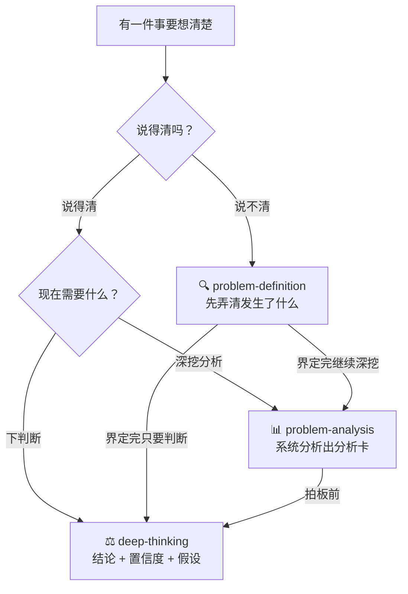

# thinking-skills

<p align="center"><strong>想清楚一件事 ≠ 花很长时间想。</strong></p>

<p align="center">多数时候，缺的不是努力，是工序。</p>

<p align="center">这个集合用三个 skill 各拦住一种"想不清楚"，外加一个入口负责指路；按需取用，不必全上。</p>

---

## 三种翻车现场

你可能见过（或正在经历）：

1. **没弄清就行动**："项目推进很慢" → "大家都不配合" → "是不是该换人？"——跳过了"到底发生了什么"，半年后发现改错了地方。**在错误的问题上高效行动，是最贵的错误。**
2. **分析空转**：会开了两小时，任务拆了、进度压了，除了问题本身，什么都推进了。
3. **裸结论拍板**："我觉得该自建"——没有把握程度、没有假设清单，没人问过"你什么情况下是错的"。

三个 skill 一人拦一种：**problem-definition** 拦第 1 种，**problem-analysis** 拦第 2 种，**deep-thinking** 拦第 3 种。

## 效果长什么样（before / after 三连）

以下为效果演示（示例数据非真实案例），展示同一件事经手后的变化：

**① problem-definition —— 把"我觉得"还原成"发生了什么"**

> **原话**："最近团队配合很差，项目推进特别慢。"
> **界定后**："过去三周，接口联调比计划晚 8 个工作日；其中 4 次延期没有负责人确认记录。'配合很差'是待核实的解释，不是事实结论。"

**② problem-analysis —— 把乱材料变成能落地的结论**

> **原状**："项目延期三周，缺陷一堆，不知道从哪下手。"
> **分析后**："根因：接口变更无确认流程（7 个关键缺陷中 4 个源于此，把握 70%）。马上做：冻结未确认变更；排期做：建立变更确认清单；不做：重构旧模块。验证指标：两周内'未确认变更数'降为 0。"

**③ deep-thinking —— 给结论上保险**

> **原状**："该不该自建数据平台？"——一般 AI 会给一堆利弊清单，看完还是不会选。
> **深想后**："结论【置信度 70%】：先采购、缓自建。关键假设：数据量两年内不涨 10 倍。重判触发器：6 个月内数据量增速超 5 倍，此结论需重算。"

## 给谁用

想让 AI 陪你认真想问题、而不是快速给答案的人：交付顾问、项目经理、团队负责人、分析师——以及所有被"又长又散、没有结论的会"折磨过的人。

## 一眼看懂：四个 skill 各干什么

**按需取用，多数场景只找其中一个；接力是选项，不是义务。**

| Skill | 它管什么 | 什么时候找它 | 你会拿到什么 |
|-|-|-|-|
| 🔍 **problem-definition** | 把"我觉得不对"还原成"到底发生了什么" | 事情没说清：模糊、感受混杂、刚接到别人的交代 | 事实 / 感受 / 判断三栏分离表 + 待问清单 + 一句话收束 |
| 📊 **problem-analysis** | 把一堆乱材料变成带证据、能落地的结论 | 问题清楚了，要挖根因、排优先级、验证方案、出汇报 | 完整分析卡：根因 + 证据 + 行动清单 + 验证指标 |
| ⚖️ **deep-thinking** | 给结论上"置信度 + 关键假设"的保险 | 要拍板了：该不该做、靠不靠谱、怎么选 | 分置信度的结论 + 关键假设 + 重判触发器 |
| 🚦 **thinking-suite** | 集合的交警，只负责指路 | 不确定该用哪个 | 路由结论 + 交接说明 |

## 目录

- [怎么选：路由图 + 场景速查](#how)
- [各 skill 详解](#detail)
  - [problem-definition 界定问题](#pd)
  - [problem-analysis 系统分析](#pa)
  - [deep-thinking 结论的纪律](#dt)
  - [thinking-suite 集合入口](#ts)
- [安装（含不用 DeepWorks 的用法）](#install)
- [第一次跑](#first-run)
- [共同的底线](#baseline)
- [来源与背书](#source)

---

<a id="how"></a>

## 怎么选（路由图 + 场景速查）



不确定时把问题丢给 **thinking-suite**，它直接告诉你该找谁。

**场景速查表**（按顺序判断，命中即停）：

| 你的处境（真实说法） | 用哪个 | 你会拿到什么 |
|-|-|-|
| "老板/客户让我做 X，我总觉得没说清楚，但不知道问什么" | problem-definition（接收确认） | 三栏分离表 + 待问问题清单 + 可直接发出的核对话术 |
| "最近团队氛围很怪，我说不上来哪里不对" | problem-definition（AI 自动推荐切入点） | 从还原事实切入的界定过程 |
| "帮我筛一下这条转述里哪些是真的" | problem-definition（单点取用） | 事实 / 解读两栏，推测标"待验证" |
| "项目延期了，一堆缺陷清单和变更记录，帮我理出头绪" | problem-analysis（直接分析） | 完整分析卡：根因 + 证据 + 行动清单 + 验证指标 |
| "事情十几件资源有限，先做哪个" | problem-analysis（决策矩阵） | 四格优先级：马上做 / 排期做 / 顺手做 / 不做清单 |
| "这个方案看着完美，我心里发虚" | problem-analysis（逆向思维） | 最可能的 3 种失败方式 + 逐条防御检查 |
| "该不该接这个项目 / 这个方案靠谱吗 / 你怎么看" | deep-thinking | 分置信度的结论 + 关键假设 + 重判触发器 |
| "深度思考一下 X / /deep X" | deep-thinking（强制全流程） | 完整思考过程 + 带置信度结论 |
| "这事怎么跟领导说" | 简短同步 → problem-definition⑧；正式汇报分析成果 → problem-analysis 场景 16 | 三行版 + 追问预案 / 金字塔四段式 |
| "这几个 skill 我该用哪个" | thinking-suite | 路由结论 + 歧义裁决 |

**一句裁决口径**："把事本身挖深"（根因 / 材料 / 排优先级 / 验证方案）→ problem-analysis；"给事下判断"（该不该 / 对不对 / 怎么选）→ deep-thinking。

---

<a id="detail"></a>

# 各 skill 详解

<a id="pd"></a>

## 🔍 problem-definition —— 界定问题

> **价值**：很多团队一发现异常就开始找方案——"项目推进很慢" → "大家都不配合" → "是不是要换人？"中间少了最重要的一步：确认到底发生了什么。这个 skill 阻止那个更昂贵的错误：**在错误的问题上高效行动**。

### 八个方法（可单点取用，也可串成完整流程）

| 方法 | 它会帮你做什么 | 关键规则 |
|-|-|-|
| ① 问题分型 | 区分发生型 / 潜在型 / 理想型 | 分型可复合；理想型不问"为什么"，潜在型不忙复盘 |
| ② 还原事实 | 把"很乱、太慢、不配合"改写成可核实事实 | 四类主观词转写 + 六维量化 + 补参照值 |
| ③ 筛事实 | 从汇报、邮件、转述中分出事实和加工 | 拆 → 找七类加工痕迹信号 → 核验三问 → 分栏 |
| ④ 5W2H 补边界 | 补齐对象、时间、范围、原因 | Why 问两遍：为什么出问题 + 当初的承诺基于什么依据 |
| ⑤ 5 Why 追原因 | 追到第一个只能靠猜的环节，停在那里 | AI 追、用户给依据；输出"需要补的证据"清单 |
| ⑥ 假设反证 | 检查你想当然的假设 | 假设三问 + 反证三问 + 补救方案的"承重墙"检验 |
| ⑦ 目标-现状-差距 | 把"要不要换 X"改成可验证的差距问题 | 改写后说不出差距 = 问题还没界定 |
| ⑧ 向上沟通 | 三行同步 + 追问预案 + 汇报前准备清单 | 事+影响 / 已做 / 要他做什么 |

### 五种使用模式

| 模式 | 何时用 | 行为 |
|-|-|-|
| 接收确认 | 正从他人处接到需求/交代/转述 | 不分析问题本身，跑三步确认：三栏分离 → 5W2H 扫空位 → 复述核对话术。**凡是只能靠"我猜"回答的空位 = 一个要当场问的问题** |
| 单点取用（默认） | 点名某个方法 | 只执行该方法，直接给结果，不铺流程 |
| 完整界定 | 明确要求"帮我梳理清楚这个问题" | 分型 → 事实 → 5W2H → 5Why → 假设反证 → 收束，分步交互 |
| AI 推荐 | 丢来模糊描述，没说要什么 | 判断最缺哪块（通常先是事实），从那个方法切入 |
| 二次界定 | 同一问题再次分析、新信息到手 | 复用已有结论只做增量，不重跑全流程 |

### 日常用法

```text
李总刚说"把最近的客户拜访情况整理一下，周末给我"，我总觉得没说清楚。
→ 输出三栏表 + 待问清单 + 可直接发的核对话术："我确认下理解：把最近一个月的
  拜访报告汇总一份，重点标出客户反映的问题和风险，您周末看——有没有出入？"

帮我筛一下这条转述："听说小王开会又迟到半小时，明显不重视项目。"
→ 事实（小王某日会议迟到约 30 分钟，来源：签到记录）
  解读（"不重视"=推测，待验证）

用 5 Why 找到第一个没有证据的环节。
帮我把目标、现状和差距整理成一页。
```

### 你会得到什么

- 问题类型（发生 / 潜在 / 理想，可复合）
- 可核实事实（含出处）、待确认信息、待核实推测——三者严格分栏
- 当前未闭环的一环（关键敞口）
- 一句话收束：`现状 + 目标 + 差距 + 影响`
- 按需产出：向上同步三行版 + 追问预案 / 和当事人的核对话术 / 行动清单 + 待确认证据清单

---

<a id="pa"></a>

## 📊 problem-analysis —— 系统分析

> **价值**：面对大而模糊、千头万绪的问题（项目延期、团队混乱、指标恶化），不缺努力，缺的是**什么场景调哪个模型、怎么用**。这个 skill 用 16 个场景 × 16 个思维模型把分析做实，交付能落地的分析卡，而不是拉会、拆任务、压进度地空转。

### 四步流程

```
第 0 步 问题卡（必走，30 秒）
   背景一句话：谁、在哪段时间、发生了什么
   要做的决定一句话：分析完要回答什么、做什么决定
   怎么算解决一句话：看到什么结果算完
→ 第 1 步 场景定位（对照 16 场景地图，找到"卡在哪一步"）
→ 第 2 步 执行模型（一次分析通常只走 2-4 个模型，按需选用）
→ 第 3 步 输出分析卡
→ 第 4 步 汇报前五句话自查（交付前质量门）
```

**汇报前五句自查**（任何一句答"是"就回去补一步）：

1. 我是不是听到第一个解释，就没再找过别的？→ 第一性原理
2. 我是不是因为最近见过类似案例，就信了？→ 证伪思维
3. 我是不是只看了出问题的，没看没出问题的？→ 证伪思维
4. 我是不是只收集了支持我想法的证据？→ 证伪思维
5. 我是不是因为已经投入很多，舍不得推翻？→ 沉没成本

### 16 场景地图（★ = 高频模型）

**第一步 定义问题**——问题问对了，后面才不白干：

| 场景画面 | 模型 | 执行要点 |
|-|-|-|
| 问题只有一句话，真因藏在后面 | 5 Why ★ | 每个回答必须是上一句的直接原因，问到能动手改的一层就停 |
| 所有人都说"显然该这么做" | 第一性原理 | 列全部默认假设，逐个标"有证据/没证据/想当然"，只基于有证据的事实重新定义 |

**第二步 拆解问题**——把大象切成能下口的小块：

| 场景画面 | 模型 | 执行要点 |
|-|-|-|
| 问题大而模糊 | 逻辑树 ★ | 拆 3-5 个同维度主分支；树是地图不是结论，挑证据最多的一支继续拆 |
| 只有一堆零散材料 | 归纳法 | 归类 → 找重复模式 → 提待验证假设；模式≠真相，标注偏差来源 |
| 分支打架，有重叠有遗漏 | MECE ★ | 三查：两支是不是一件事？重要情况覆盖了没？同层同维度吗？ |
| 问题重要又复杂 | 假设-验证闭环 ★ | 归纳提假设 → 演绎搭原因树 → 证据验证 → 结论-证据-行动-验证指标，行动后带新事实再循环 |
| 候选原因都说得通 | 反事实检验 | 逐个问"这个原因不存在，问题还会发生吗？" |
| 问题几十条，资源只够打一两个 | 80/20 ★ | 按来源统计占比，集中火力打贡献最大的少数 |

**第三步 验证与决策**——结论经得起挑战，才敢行动：

| 场景画面 | 模型 | 执行要点 |
|-|-|-|
| 证据越攒越多，越查越自信 | 证伪思维 ★ | 结论必须可被推翻；一条反例顶五条支持；证据三问：谁给的？全吗？口径一致吗？ |
| 结论要拍了，心里没底 | 概率思维 | 标把握分：<50% 继续查；50-80% 待确认；>80% 可行动；每个反例先砍 20 分 |
| 怕漏了相关方的信息 | 换位思考 | 全部相关方各答三问：他的目标？他的约束？他手里有什么我不知道的信息？ |
| 方案看着完美，心里发虚 | 逆向思维 | 反过来想"什么会让它必然失败"：列 3 个最可能失败方式，逐个检查防住了吗 |
| 行动要定了，怕连锁反应 | 二阶思维 | 问两次"然后呢"，重点写相关人会怎么反应 |
| 事情十几件，先做哪件 | 决策矩阵 ★ | 影响×难度各打 1-5 分：大低=马上做／大高=排期／小低=顺手／小高=写进不做清单 |

**第四步 收尾表达**——分析的价值在交付那一刻才兑现：

| 场景画面 | 模型 | 执行要点 |
|-|-|-|
| 总想"再查一点更稳" | 沉没成本 | 只看边际，三条停止线满足任一就交；没查透的单独列一节 |
| 分析完了，要汇报 | 金字塔原理 ★ | 结论先行，按对方关心的顺序组织：结论 → 证据（≤3 条）→ 行动 → 验证指标 |

### 三种工作模式

| 模式 | 适用 | 行为 |
|-|-|-|
| A 教练模式 | 你想自己想清楚（"带我分析""一步步来"） | 一次只问 1-2 个问题引导，全程大白话，不用术语 |
| B 直接分析（默认） | 给问题+材料要结果 | 代跑四步流程，输出完整分析卡 |
| C 单模型工具 | 点名某个模型（"用 5 Why 帮我追"） | 直接执行该模型，只输出对应产物 |

### 日常用法

```text
手里一堆缺陷清单和变更记录，帮我理出头绪。
项目延期三周了，帮我找到根因，排个处理优先级。
先做哪个？用决策矩阵帮我排一下。
这个方案靠不靠谱？有什么风险？帮我把分析结论组织成汇报。
```

### 你会得到什么（分析卡）

```text
【问题卡】背景 / 要做的决定 / 怎么算解决
【场景判断】当前卡在场景 N，走过的模型路径
【分析过程】每个模型一段：做了什么、发现了什么
【结论】带把握分（%）
【关键证据】3 条以内
【行动清单】马上做 / 排期做 / 顺手做 / 不做清单
【验证指标】一周或一个迭代后，看什么指标、变到多少算有效
【未查透】没验证完的单独列出，附下一步怎么查
```

---

<a id="dt"></a>

## ⚖️ deep-thinking —— 结论的纪律

> **价值**：深度思考 ≠ 想得久、想得多，而是**对抗急着下结论的本能**——在给出第一个答案之前，强行插入几道工序：重构问题、清点假设、寻找证伪、推演后果。它是 AI 的思考前置层，让每一次判断都带上"我有多确定、我赌了什么、什么时候该改判"。

### 思考流程：3 核心步（必走）+ 4 可选步（按需）

**核心 1 重构问题**：不急着答，先写"你真正在问什么"。区分表象问题与根本问题——你问"该不该跳槽"，真正的问题可能是"我为什么在现在的工作里感到无意义"。必要时用 5 Why 穿一层。

**核心 2 清点已知与未知**：信息分四类，绝不混写——

| 类别 | 含义 |
|-|-|
| 事实 | 可被验证、有出处 |
| 推断 | 基于事实的合理推导 |
| 假设 | 未经验证、当作前提在用 |
| 观点 | 价值判断、立场 |

标出信息缺口；缺口关键且阻塞判断时，主动问 1-2 个澄清问题，不闷头假设。

**核心 3 结论 + 置信度**：明确标注哪部分高把握、中把握、低把握；列出**关键假设**（不成立则结论要重判）和**重判触发器**（什么新信息出现时该改判）。

**四个可选步**：

| 可选步 | 启用时机 | 方法 |
|-|-|-|
| A 多框架拆解 | 问题有多个合理分析角度 | 至少两个框架：第一性原理 / MECE / 系统视角 / 利益相关方 / 时间尺度 / 反向思考 |
| B Steelman 反方 | 问题有对立面 | 把反对意见讲到反对者本人都点头认可，找出自己最脆弱的点。不立稻草人，立铁人 |
| C 二阶后果 | 决策有连锁影响 | 问"然后呢？再然后呢？"，注意非线性和意外副作用 |
| D Pre-mortem | 决策不可逆或高成本 | 假设结论已经错了，倒推 top 3 失败原因，每个写一句提前规避或监测 |

### 什么时候触发

**走全流程**：问题有争议或对立面；第一次面对的新领域；影响大或不可逆；涉及因果判断和预测；你给出论断要它评估成立度；显式命令（"深度思考一下 X / 深想一下 X / /deep X"）。

**快速过**：事实查询；明确指令执行；单文件小修改；闲聊确认；同一问题本会话已深想。

**说不清要不要用时**：它会主动问一句"这个问题值得深想一下，要不要走深度思考流程？"——只问一次，拒绝就正常回答。

### 输出样例

**精简模式**（中等复杂度，只要答案）：

```text
结论：[一句话]
- [高把握] ...
- [中把握] ...
- [低把握] ...
关键假设：...
重判触发器：...
（简注走过哪些步）
```

**完整模式**（重大/不可逆/有争议）：

```text
重构问题 → 已知/未知四分类 → 多框架拆解 → Steelman 反方
→ 二阶后果 → Pre-mortem → 结论（分置信度）+ 关键假设 + 重判触发器
```

### 日常用法

```text
这个数据治理方案你觉得靠谱吗？
该不该接这个项目？
"我们的瓶颈是人手不够"，这个判断成立吗？
深度思考一下：我们要不要自建数据平台？
```

---

<a id="ts"></a>

## 🚦 thinking-suite —— 集合入口

**只做一件事：指路。** 不做界定、不做分析、不给结论。

当你不确定用哪个 skill、或抛出一个模糊的思考请求时，它负责：

- 按路由决策树把你分派给对的成员
- 裁决歧义场景，例如：
  - "帮我分析 X"（无限定词）→ deep-thinking 默认接；带"系统/乱材料/排优先级"等限定词 → problem-analysis
  - "这方案我觉得哪里不对"（有评估对象）→ deep-thinking；"氛围很怪说不上来"（说不清问题）→ problem-definition
  - "怎么跟领导说" → 简短同步找 problem-definition⑧；正式汇报分析成果找 problem-analysis 场景 16
- 说明成员间的交接协议：problem-definition 界定完把收束句（`现状 + 目标 + 差距 + 影响`）交给 problem-analysis 当问题卡；problem-analysis 发现事实没弄清时退回 problem-definition；所有最终结论都带 deep-thinking 要求的置信度和关键假设

路由规则的单一事实来源在 [deep-thinking/SKILL.md](deep-thinking/SKILL.md) 的协作章节。

---

<a id="install"></a>

## 📦 安装

### DeepWorks / opencode 用户

整库克隆，然后按需复制成员（每个成员都能独立工作，也可以只装你需要的一两个）：

```bash
git clone https://github.com/guangquan123/thinking-skills
```

```bash
# 全部四个成员装到全局
cp -r thinking-skills/deep-thinking       ~/.agents/skills/
cp -r thinking-skills/problem-definition  ~/.agents/skills/
cp -r thinking-skills/problem-analysis    ~/.agents/skills/
cp -r thinking-skills/thinking-suite      ~/.agents/skills/
```

项目级安装则复制到项目的 `.opencode/skills/` 下；Windows 用资源管理器或 `Copy-Item` 复制即可。

### 不用 DeepWorks / opencode 也能用

每个成员的 `SKILL.md` 本身就是一份完整的结构化指令集，直接贴给任何支持长上下文的 AI 即可工作。另外两份即取即用：

- `problem-analysis/references/models.md`：16 个模型的完整用法、案例演示和**原始 AI 提示词**，可原样复制给任意 AI（ChatGPT、DeepSeek、豆包、Kimi 等）
- `problem-analysis/references/coach-prompt.md`：八步教练流程提示词，贴给任意 AI 并在末尾写上你的问题，它会一步步带你分析

<a id="first-run"></a>

## 🚀 第一次跑

在已加载 skill 的 Agent 里直接说你的事，它会自己路由：

```text
李总刚说"把最近的客户拜访情况整理一下，周末给我"，我总觉得没说清楚。
（→ problem-definition 接收确认）

手里一堆缺陷清单和变更记录，帮我理出头绪。
（→ problem-analysis 直接分析）

这个数据治理方案你觉得靠谱吗？
（→ deep-thinking 全流程）
```

<a id="baseline"></a>

## 🛡️ 共同的底线（所有成员一致）

1. **不编造**：缺数据只写"待确认"，不拿猜测补齐。
2. **推测必标注**：AI 推断的内容统一写"待核实"。
3. **事实带出处**：找不到出处的内容只能算印象。
4. **结论带把握**：不给置信度的结论是不完整的结论。

<a id="source"></a>

## 来源与背书

- **problem-definition** 的方法论来自飞书文档《如何界定问题思维模型》（问题界定卡、三类分型、评价词转写、七类加工痕迹、核验三问、5Why 停止规则、反证三问、决策句改写）；向上沟通模块经实战复盘验证后沉淀。
- **problem-analysis** 的模型库为开源思维模型（16 场景 × 模型）；每个模型的详细用法、案例演示与原始提示词收录在 `references/models.md`，可原样复制给任意 AI。
- 所有成员的规则都自带可核对的判据——`SKILL.md` 即规则全文，欢迎逐条检验。

## 同步协议（仅维护者）

<details>
<summary>展开查看仓库同步方式</summary>

成员的本地工作位置：`deep-thinking` 在项目的 `.opencode/skills/`，其余三个在全局 `~/.agents/skills/`。修改 skill 后同步到本仓库：

1. 把成员最新文件复制到本仓库同名子目录
2. 在仓库根目录执行：

```powershell
powershell -ExecutionPolicy Bypass -File ".\scripts\sync-to-github.ps1" -Message "feat: 本次更新说明"
```

脚本走 GitHub REST API 推送（绕开本机 git push 被网络重置的问题），强制 UTF-8 处理中文 commit 消息，凭据自动从 git credential manager 读取。

</details>
