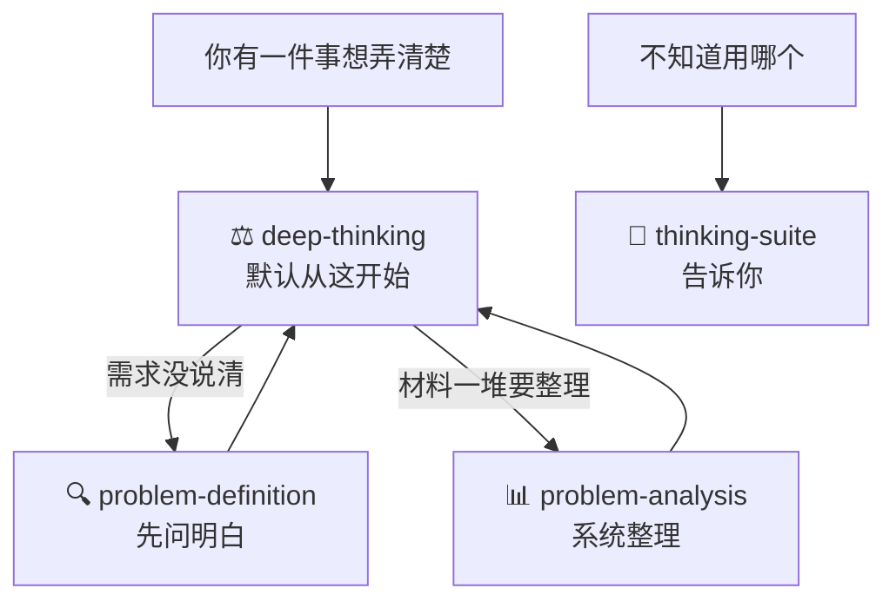

# thinking-skills

**一句话：装了这套技能，AI 会先把事情想清楚，再回答你。**

你问 AI 重要问题时（该不该做、靠不靠谱、先做哪个），它经常：

- 给你一堆利弊清单，你看完还是不会选
- 接到一个没说清的需求就直接干，方向整个跑偏
- 你把一堆材料丢给它，它只会复述，不给结论

这套技能教给 AI 一套思考工序：先把问题拆到本质，多角度、对立面地验证，最后给你带把握程度的结论，并说清楚什么情况下要推翻重来。

---

## 一、这是什么

四个技能，各管一件事：

| 技能 | 它干什么 | 什么时候用 |
|-|-|-|
| ⚖️ **deep-thinking** | 把一件事想透 | **默认入口**。想把一件事弄明白、要下判断，先用它 |
| 🔍 **problem-definition** | 先弄清到底发生了什么 | 需求说得含糊，你不知道该问什么 |
| 📊 **problem-analysis** | 把一堆材料整理成能行动的结论 | 要挖根因、排优先级、验证方案 |
| 🚦 **thinking-suite** | 告诉你该用哪个 | 你不知道用哪个的时候 |

它们怎么配合：**默认都从 deep-thinking 开始**。它想的过程中发现需求没说清，先转给 problem-definition 问明白；发现材料需要系统整理，转给 problem-analysis。你分不清的时候，把问题丢给 thinking-suite，它直接告诉你找谁。



---

## 二、有什么用：三个例子看效果

下面都是演示例子，看安装前后的差别。

### 例子 1：你问 AI"这个方案靠谱吗"

**没装技能**：

> 自建的好处：……；自建的坏处：……；采购的好处：……。总之要结合实际情况综合考虑。

你看完还是不知道该选哪个。

**装了 deep-thinking**：

> 结论：先采购，缓自建。把握 70%。
> 我这么想的：这个问题的本质不是技术选型，是在赌数据增长速度。
> 我押的前提：数据量两年内不会涨 10 倍。
> 什么时候要重算：6 个月内数据增速超过 5 倍，就推翻这个结论重来。

### 例子 2：老板说"把客户拜访情况整理一下，周末给我"

**没装技能**：AI 马上给你一份整理模板。但"最近"是近三天还是三个月？"整理"要表格还是报告？都没人知道，很可能白干。

**装了 problem-definition**：

> 有三个地方没说明白，建议当场问清楚：
> 1. "最近"指过去 30 天吗？
> 2. 重点是拜访数量，还是客户反映的问题和风险？
> 3. 要一张简表，还是一份完整报告？
>
> 可以直接发给老板的确认话术："我确认下理解：把近一个月的拜访汇总成一张表，标出客户问题和风险，周末给您。有出入您说一声。"

### 例子 3：项目延期三周，你把缺陷清单、变更记录、会议纪要丢给 AI

**没装技能**：AI 把每份材料总结一遍，你看完还是不知道先干什么。

**装了 problem-analysis**：

> 根因：接口变更没有确认流程（7 个严重缺陷里 4 个从这里来，把握 70%）。
> 马上做：冻结所有未确认的变更。
> 排期做：建立变更确认清单。
> 不做：重构老模块（这次顾不上）。
> 有没有效看这个数：两周内"未确认变更数"降为 0。

---

## 三、怎么用

### 安装：一句话

你的 AI 只要能执行命令（DeepWorks、Claude Code、Cursor 等），把这句话发给它：

```text
请克隆 https://github.com/guangquan123/thinking-skills，把里面的技能装到你的技能目录
```

只装需要的也行：

```text
请从 https://github.com/guangquan123/thinking-skills 只安装 deep-thinking 和 problem-analysis
```

想手动装：克隆仓库后，把需要的文件夹复制到 `~/.agents/skills/`（DeepWorks / opencode 的技能目录）。Windows 直接用资源管理器复制。

### 第一次用：大白话丢出你的问题

装好后不用记任何命令，直接说事：

```text
这个数据治理方案你觉得靠谱吗？          → 触发 deep-thinking
李总让我整理客户拜访情况，感觉没说清楚。  → 触发 problem-definition
手里一堆缺陷清单和变更记录，帮我理出头绪。 → 触发 problem-analysis
```

### 想主动点名某个技能

| 你可以这样说 | 触发的技能 | 你能拿到什么 |
|-|-|-|
| "你怎么看 X""X 靠谱吗""该不该做 X" | deep-thinking | 结论 + 把握程度 + 押了什么前提 + 什么时候要重算 |
| "深度思考一下 X" | deep-thinking | 完整的思考过程 + 结论 |
| "老板让我做 X，感觉没说清楚" | problem-definition | 没说明白的点逐条列出来 + 可以直接发的确认话术 |
| "帮我筛一下这条转述里哪些是真的" | problem-definition | 事实和猜测分开列，猜测都标清楚 |
| "帮我理出头绪""找到根因" | problem-analysis | 根因 + 马上做 / 排期做 / 不做清单 + 验证指标 |
| "事情太多，先做哪个" | problem-analysis | 优先级排好的清单 |
| "这事怎么跟领导说" | problem-definition 或 problem-analysis | 三行版同步话术，或正式汇报结构 |
| "我该用哪个技能" | thinking-suite | 直接告诉你找谁 |

---

## 四、四个技能详解

### ⚖️ deep-thinking：把一件事想透

你丢给它一件事（一个判断、一个选择、一个看不明白的局面），它按五步想完再回答：

| 步骤 | 它做什么 |
|-|-|
| 1. 先问"你真正在问什么" | 你问"该不该自建数据平台"，它先想明白真正要回答的是"现在的数据量，买现成的够不够用" |
| 2. 把信息分类 | 你说的内容里，哪些是事实（查得到出处）、哪些是猜测、哪些是没验证就当前提用的假设、哪些只是立场。缺关键信息它会先问你，不瞎猜 |
| 3. 换多个角度看 | 从本质、整体、各方利益、时间先后等角度至少看两遍 |
| 4. 让对立面攻击结论 | 站到反对者那边，把自己的结论反驳一遍，找出最薄弱的地方 |
| 5. 反着检查 | 问"什么情况下这个结论是错的"，提前把翻车点找出来 |

**最后给你三样东西**：

- 结论，标明把握有多大（高 / 中 / 低，或百分比）
- 它押了什么前提（前提不成立，结论就要推翻）
- 出现什么情况要重算

**例子**：

> 你问："我们的瓶颈是人手不够"，这个判断对吗？
> deep-thinking："这个判断把握不高，大概 40%。事实部分：近两个月需求涨了 3 倍，这是真的。但'人手不够'是解释，还有两个没排除的可能：需求本身砍得不够，或者返工占了太多时间。建议先查返工率，再决定要不要加人。"

**你可以这样说**："这个方案靠谱吗" "该不该接这个项目" "这个判断成立吗" "深度思考一下 X"。

### 🔍 problem-definition：先弄清发生了什么

你接到的是含糊的交代、别人的转述、一句说不清的话时，它先帮你弄清"到底发生了什么"再动手。问题弄错了，干得越快浪费越大。

它做三件事：

1. **把话拆开**：你说的、别人说的里面，哪些是事实（带出处）、哪些是感受、哪些是没验证的猜测，分开列清楚。
2. **找没说明白的地方**：逐条检查"谁、什么时候、什么范围、当初的承诺是什么"，任何一个只能靠猜的地方，都是一个要当场问的问题。
3. **追证据、验假设**：往下追问原因，问到第一个拿不出证据的地方停下来，告诉你"还差哪些证据"；把你想当然的假设逐条挑出来，问"这个验证过吗"。

它有 8 个方法，可以整流程走，也可以单个点名用：

| 方法 | 帮你做什么 |
|-|-|
| 问题分型 | 分清这是"已经出事了""怕要出事"还是"想要更好"，三种情况问法完全不同 |
| 还原事实 | 把"太慢、很乱、不配合"改写成能核实的说法：谁、什么时间、多少量 |
| 筛事实 | 从转述、汇报里把事实和添油加醋分开 |
| 补边界 | 把对象、时间、范围、依据补齐 |
| 追原因（5 Why） | 一层层追问，问到第一个没有证据的地方就停 |
| 验假设 | 把你想当然当成真的那些前提，逐条检验 |
| 摆差距 | 把"要不要换人/换工具"改成"目标和现状差多少" |
| 向上沟通 | 给你三行版的同步话术 + 领导可能追问的问题预案 |

**例子**：

> 你说：帮我筛一下这句转述："听说小王开会又迟到半小时，明显不重视项目。"
> problem-definition："事实：小王某次会议迟到约 30 分钟（来源待查签到记录）。'听说'说明来源不清；'又'暗示经常发生，但没有记录支撑；'不重视项目'是对动机的猜测，不能当事实用。建议先查签到记录，再决定要不要谈。"

**你可以这样说**："老板让我做 X，感觉没说清楚" "帮我筛一下这条转述" "用 5 Why 追一下原因" "这事怎么跟领导说"。

### 📊 problem-analysis：把材料系统地整理出结论

问题本身清楚了，但材料一堆、千头万绪。它按"场景配模型"做系统分析，最后给你一张能直接照着干的分析卡。

它分四步：

1. **花 30 秒填问题卡**：背景一句话、要做的决定一句话、怎么算解决一句话。
2. **对场景**：你的情况属于 16 种常见场景里的哪一种（比如"问题只有一句话，真因藏在后面""事情太多，先做哪个"）。
3. **配模型**：每种场景配好了对应的思考模型，一次分析通常用 2-4 个。
4. **出结论前自查**：用 5 个问题检查常见错误，比如"是不是只找了支持自己的证据""是不是第一个解释就没再怀疑过"。

最常用的几个场景和模型：

| 你的情况 | 用什么模型 | 它怎么干 |
|-|-|-|
| 问题只有一句话，真因藏在后面 | 5 Why | 一层层追问原因，问到能动手改的那层停下 |
| 问题太大太模糊 | 逻辑树 | 拆成几块，挑证据最多的一块继续挖 |
| 问题几十条，只够处理一两个 | 80/20 | 按来源统计，集中打贡献最大的少数 |
| 证据越攒越多，越查越自信 | 证伪 | 主动找反例，一条反例顶五条支持 |
| 事情太多，先做哪个 | 决策矩阵 | 每条按"影响大小 × 难度高低"打分排队 |
| 分析完了要汇报 | 金字塔 | 结论放最前面，证据不超过 3 条，最后说要干什么 |

<details>
<summary>展开全部 16 个场景</summary>

| 阶段 | 你的情况 | 模型 | 执行要点 |
|-|-|-|-|
| 定义问题 | 问题只有一句话，真因藏在后面 | 5 Why ★ | 问到能动手改的一层就停 |
| 定义问题 | 所有人都说"显然该这么做" | 第一性原理 | 把默认假设逐条列出来，只基于有证据的事实重新定义 |
| 拆问题 | 问题大而模糊 | 逻辑树 ★ | 拆 3-5 块，挑证据最多的一支继续 |
| 拆问题 | 只有一堆零散材料 | 归纳法 | 归类找规律，提待验证的假设 |
| 拆问题 | 分支之间打架 | MECE | 查重叠、查漏项、查同一层是不是一个维度 |
| 拆问题 | 问题重要又复杂 | 假设-验证闭环 ★ | 提假设 → 搭原因树 → 证据验证 → 行动后拿新事实再来一轮 |
| 拆问题 | 候选原因都说得通 | 反事实检验 | 逐个问"这个原因不存在，问题还会发生吗" |
| 拆问题 | 问题几十条，资源只够打一两个 | 80/20 ★ | 按来源统计占比，集中打大头 |
| 验证决策 | 证据越攒越多，越查越自信 | 证伪思维 ★ | 主动找反例；证据三问：谁给的、全不全、口径一致吗 |
| 验证决策 | 结论要拍了，心里没底 | 概率思维 | 给把握打分：低于 50% 继续查，80% 以上才行动 |
| 验证决策 | 怕漏了相关方的信息 | 换位思考 | 每个相关方问三句：他的目标、他的约束、他知道什么你不知道的 |
| 验证决策 | 方案看着完美，心里发虚 | 逆向思维 | 反过来想"什么会让它失败"，列 3 种最可能翻车的方式 |
| 验证决策 | 行动要定了，怕连锁反应 | 二阶思维 | 问两次"然后呢"，重点写别人会怎么反应 |
| 验证决策 | 事情太多，先做哪个 | 决策矩阵 ★ | 影响 × 难度打分排队 |
| 收尾 | 总想"再查一点更稳" | 沉没成本 | 只看继续查值不值，不值就交 |
| 收尾 | 分析完了要汇报 | 金字塔原理 ★ | 结论先行，证据 ≤3 条，落到行动 |

</details>

**最后给你一张分析卡**：

```text
根因（带把握程度）
关键证据（3 条以内）
行动清单：马上做 / 排期做 / 顺手做 / 不做
验证指标：一周后看什么数字、变到多少算有效
没查透的：单独列出来，附下一步怎么查
```

**例子**：

> 你问：项目延期三周了，帮我找到根因，排个处理优先级。
> problem-analysis："根因：接口变更没有确认流程（把握 70%）。马上做：冻结未确认变更；排期做：建变更确认清单；不做：重构老模块。验证指标：两周内未确认变更数降为 0。未查透：测试环境问题是否也有贡献，下一步找测试记录。"

**你可以这样说**："帮我理出头绪" "找到根因" "先做哪个" "这个方案有什么风险" "帮我把分析组织成汇报" "用决策矩阵帮我排一下"。

### 🚦 thinking-suite：告诉你用哪个

你不知道该用哪个技能时，把问题丢给它。它告诉你找谁、为什么。它自己不分析问题。

比如："帮我分析 X"没说别的 → 它让你找 deep-thinking；"这一堆材料帮我理理" → 它让你找 problem-analysis；"感觉哪里不对但说不上来" → 它让你找 problem-definition。

---

## 五、凭什么信它

四条规矩，所有技能一致执行：

1. **不编**：缺数据就写"待确认"，不拿猜测凑数。
2. **猜的必标注**：AI 推出来的内容统一标"待核实"。
3. **事实带出处**：说不出出处的只能算印象。
4. **结论带把握**：不给把握程度的结论是不完整的结论。

方法来源：problem-definition 的界定方法来自《如何界定问题思维模型》并经实战复盘打磨；problem-analysis 的模型库为公开的经典思维模型，每个模型的用法和提示词在 `problem-analysis/references/models.md`，可原样复制到任何 AI 使用（ChatGPT、DeepSeek、豆包、Kimi 等）。
